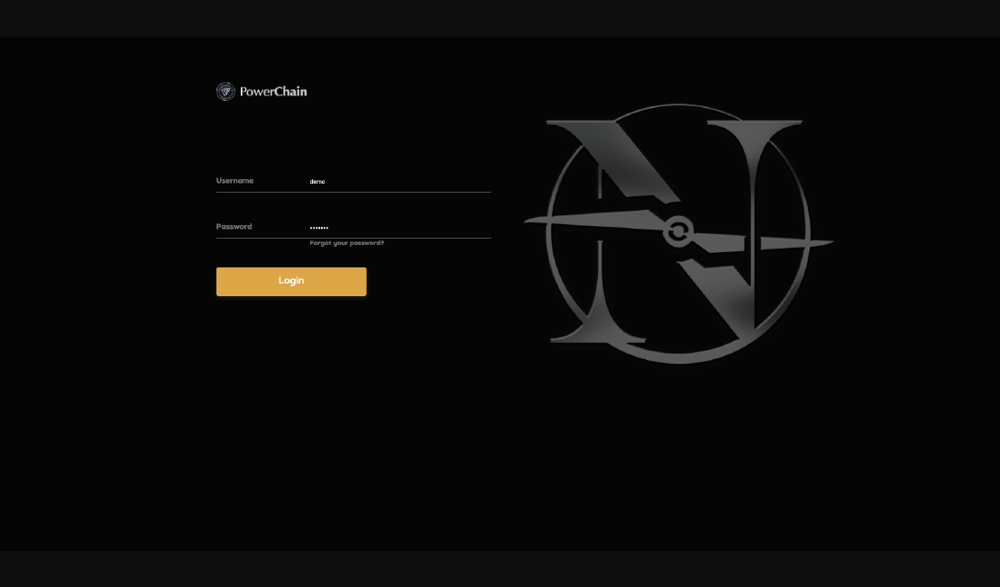
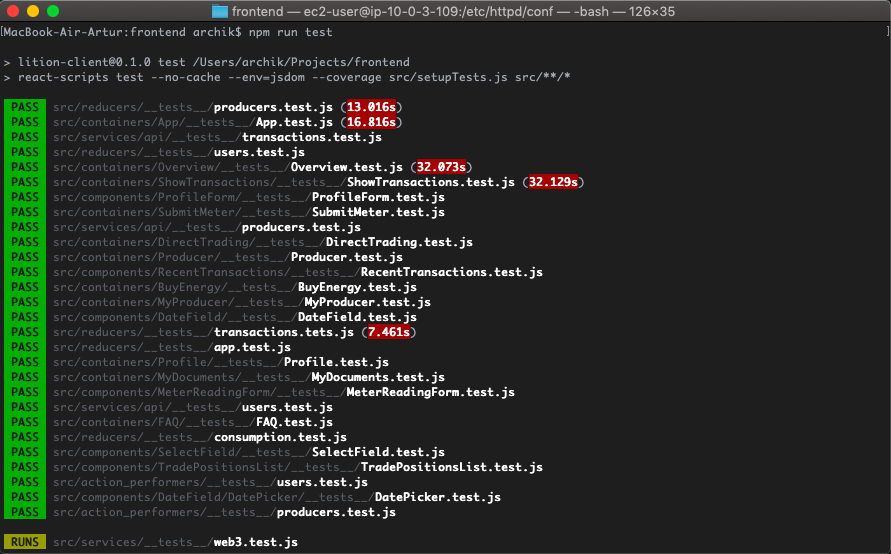
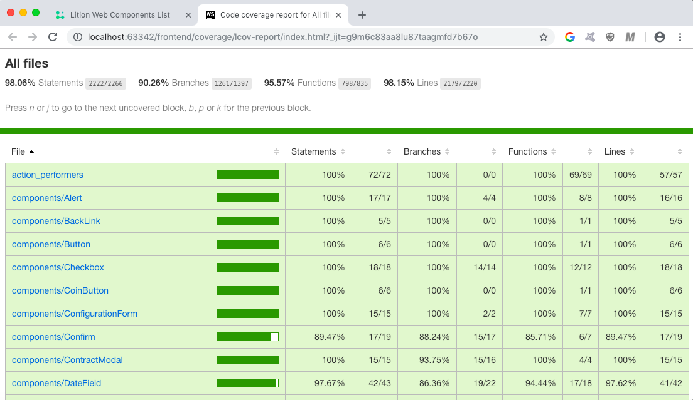
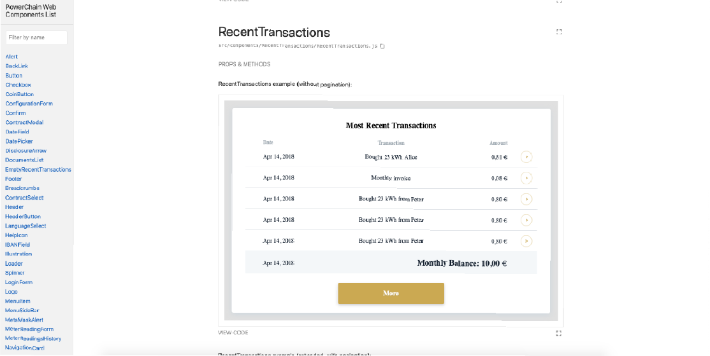

# Nordic Energy - Energy Trading Platform

### PowerChain Blockchain based energy trading frontend


<p align="left">
   <a rel="license" href="http://creativecommons.org/licenses/by-nc-nd/4.0/"></a><br /><br />
   <a href="https://codecov.io/gh/archik408/trading-platform-client"></a>
   <a href="https://codecov.io/gh/archik408/trading-platform-client"></a>
   <a href="https://bitbucket.org/nordicenergy/frontend/addon/pipelines/home#!/results/411"></a>
</p>
<p align="left">
    <a href="https://twitter.com/intent/follow?screen_name=nordic_energy"></a>  
</p>

## Introduction
[Nordic Energy](https://www.nordicenergy.co) is developing the only scalable public-private Blockchain with deletable data features, made for commercial products. Designed with Nordic Energy's P2P energy trading use case, and co-innovated with SAP.

This repository shows the frontend for the energy use case, which is the world's first peer to peer energy trading platform commercially available to a mass market. You can test it at https://powerchain.nordicenergy.co with the credentials demo / demo1234. The Frontend part of its trading platform is built with modern JavaScript, HTML and CSS, but there are some helpers: [React](https://reactjs.org/) as a framework, [Jest](https://jestjs.io/en/) as a testing tool and [Styleguidist](https://react-styleguidist.js.org/) as a source of documentation.

There are several articles written by Nordic Energy Developers which describe the chosen approaches of development in full. Links to them can be found below:

1. [React architecture and approach](https://medium.com/lnordicenergy-blog/powerchain-and-react-js-devblog-90843c9f1d10)
2. [Layout](https://medium.com/nordicenergy-blog/layout-of-trading-platform-devblog)
3. [Testing](https://medium.com/nordicenergy-blog/tests-docs-for-powerchain-frontend)
  
Besides, Nordic Energy has its own UI-kit which is currently under development, but it is also based on React and Styleguidist.


## Installation and start
First step is to install all application dependencies:
```
$ npm install
```

You have possibility to start standalone front-and app with local proxy server (by default `http://localhost:3000`):
```
$ npm run start
```
or build static sources for production env via following command:
```
$ npm run build
```

After that check `./build` folder.



## Configuration
The idea of this project is to keep everything simple and use as little dependencies as possible. So in the beginning the initial app structure was created with [create-react-app](https://github.com/facebook/create-react-app). 

Still there are some additional necessary tools used for this project development:

1. [Redux](https://redux.js.org/) for state management.
2. [React-router](https://github.com/ReactTraining/react-router) for navigation and app-routing.
3. [Axios](https://github.com/axios/axios) for handling AJAX requests.
4. [React-intl](https://github.com/yahoo/react-intl) and [moment.js](https://momentjs.com/) for i18n.

To start development, there are several requirements that must be met first:

1. React version >= 16.0.
2. All variables should be declared under _:root_ section.
3. Every CSS file should be imported in a related component file.
4. All necessary states of a component should be added to styleguidist.  

## Development
On this project there are several sets of development rules that are highly recommended to be followed.

The first one concerns `application layers`:

1. Follow the [DRY principle](https://en.wikipedia.org/wiki/Don%27t_repeat_yourself) (this applies to all levels - JavaScript, CSS).
2. Build your solution across [redux philosophy](https://redux.js.org/basics/basic-tutorial) and [separation of concerns](https://en.wikipedia.org/wiki/Separation_of_concerns).
3. Do not use promises or async calls, all solutions based on [unidirectional dataflow](https://en.wikipedia.org/wiki/Dataflow_programming).
4. For each domain entity and related CRUD you should create scripts with the same name, as follows:

```
/services/api/producers.js
/services/api/__tests__/producers.test.js
/reducers/producers.js
/reducers/__tests__/producers.test.js
/action_performers/producers.test.js
/action_performers/__tests__/producers.test.js
```

The second is about the way in which `React components` should be written:

1. Use everywhere classic function declaration.
2. Lambda/arrow function only for callbacks (through const is optional).
3. Do not bind class methods, use lambda _onClick="() => this.classMethod()"_.
4. Cover all path via unit and integration tests, because a test coverage of 80% minimum is expected and needed in order to be able to commit any changes. 
5. Use prettier for single code style (configure your IDE).
6. Make components independent from i18n messages and store, implement this kind of logic in containers
7. Do not use middlewares

And the third one is about writing `HTML and CSS`:

1. Use semantic tags (like header, footer, section and other), it can be verified [here](https://validator.w3.org/nu).
2. You can wrap a React component by a semantic element, not only by div.
3. Use aria-attributes and https://www.w3.org/WAI/standards-guidelines.
4. Work only with modern CSS, do not use any preprocessor (SASS or LESS).
5. Setup font-size in rem and other properties in em units.
6. Setup line-height in a number.
7. Setup normalization, base and common variables in index.css file.
8. Order your CSS properties by [this way](https://css-tricks.com/poll-results-how-do-you-order-your-css-properties).
9. Setup state classes with following names _.menu-item--active_ (as modifier in BEM), for other cases try to use classic w3c selectors, do not use classes everywhere because it makes HTMl untidy and difficult to read.
10. Setup all colors under :root section. 
11. Create new color variables, always use postfix _-color_, for background use infix _-bg-_, use standard pure color names (red, black) directly in component styles.
12. All class names should use prefix _ltn-_

## Testing

Start unit and system tests using following command:
```
$ npm run test
```



After test completion you can check coverage report here: `./coverage/lcov-report/index.html`



## Documenting

All application web components must be described through interactive documentation.

Run standalone documentation via following command (by default `http://localhost:6060`):
```
$ npm run styleguide
``` 

or build static files: 
```
$ npm run styleguide:build
``` 


